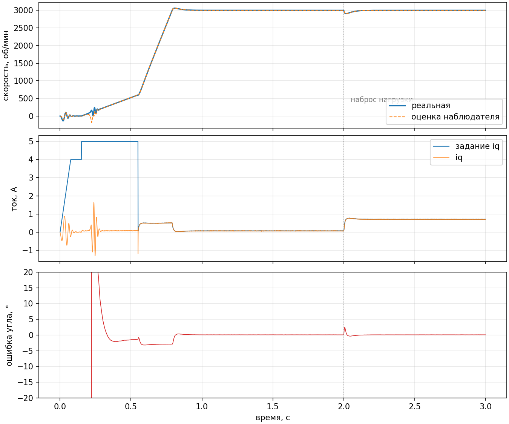

# foc-g431

Бездатчиковое векторное управление (FOC) BLDC/PMSM-двигателем для платы
**B-G431B-ESC1** (STM32G431CB, Cortex-M4F, 170 МГц). Прошивка написана на
регистрах, без HAL и CubeMX. Алгоритмическое ядро не зависит от железа и
проверяется на ПК против численной модели двигателя.




## Что внутри

| | |
|---|---|
| Преобразования | Кларк, Парк, обратный Парк; sin/cos по таблице на 256 точек с интерполяцией (ошибка < 1e-4) |
| Модуляция | SVPWM через инжекцию min-max, ограничение вектора по линейной зоне `Vbus/√3` |
| Токовый контур | два ПИ-регулятора, коэффициенты из полосы пропускания (компенсация полюса RL), развязка перекрёстных связей, условное интегрирование против насыщения |
| Наблюдатель | нелинейный наблюдатель потока Ortega + ФАПЧ для угла и скорости |
| Запуск | выставка ротора → I/f-разгон с активным демпфированием → безударный переход в замкнутый контур |
| Защиты | перегрузка по току (латчится до явного сброса), недонапряжение шины, таймаут запуска |
| Прошивка | TIM1 20 кГц центрированная ШИМ с мёртвым временем, выборка токов по OC4 в середине периода, ОУ в режиме PGA, инжектированные каналы АЦП, телеметрия по UART |

## Результаты модели

Тест гоняет контроллер против модели PMSM в осях dq (RK4, 4 подшага на
период ШИМ) с шумом АЦП ±20 мА и набросом нагрузки 0,03 Н·м на 2-й секунде.
Параметры двигателя: 7 пар полюсов, Rs = 0,25 Ом, Ls = 120 мкГн, ψ = 4,5 мВб.

| Сценарий | Выход на 3000 об/мин ±2 % | Перерегулирование | Ошибка угла наблюдателя (СКО) | Просадка при набросе |
|---|---|---|---|---|
| Номинальные параметры | 0,78 с | 2,0 % | 0,06° | 3,1 % |
| Rs +25 %, Ls −15 %, ψ +5 % | 0,78 с | 2,0 % | 1,45° | 3,0 % |

Второй сценарий имитирует нагретую обмотку, насыщение железа и разброс
магнитов: контроллер настроен на паспорт, а двигатель другой.

Ток q-оси во время I/f не равен заданию: вектор тока вращается принудительно,
ротор отстаёт на угол нагрузки, и в его системе координат моментообразующая
составляющая мала. Поэтому при переходе в замкнутый контур интеграторы
пересчитываются в систему координат наблюдателя, а не берутся из задания.

## Запуск двигателя

```
IDLE ──g── ALIGN ──── OPENLOOP ──── RUN
            │ ток плавно    │ частота растёт,     │ скорость по наблюдателю,
            │ нарастает     │ угол сдвигается     │ задание ограничено
            │               │ на скольжение       │ по ускорению
            └───────────────┴──── FAULT ◄─────────┘
                    перегрузка / недонапряжение / нет захвата
```

При управлении током ротор в I/f ведёт себя как маятник на пружине: момент
зависит от рассогласования углов, а затухание даёт только трение. Без
компенсации ротор раскачивается на ±600 об/мин вокруг принудительной
скорости. Угол вектора сдвигается пропорционально разнице между
принудительной и оценённой скоростью, это даёт недостающий член
демпфирования. Сдвиг ограничен 20° эл., потому что на малой скорости оценка
наблюдателя ещё не сошлась.

## Сборка

Тесты на ПК:

```sh
make test          # 7000+ проверок, модель двигателя в tests/motor_sim.c
make plots         # docs/run.csv → docs/response.png
```

Прошивка (нужен `arm-none-eabi-gcc`):

```sh
make firmware      # build/foc.elf, build/foc.bin, карта памяти в build/foc.map
make flash         # через st-flash, встроенный ST-LINK платы
```

Размер: около 8 КБ флеша. Состояние контроллера (264 байта) лежит в CCM SRAM:
к ней нет обращений DMA, и доступ всегда без ожиданий.

## Протокол UART

921600 бод, PB3/PB4 (виртуальный COM-порт ST-LINK).

Команды текстом, по строке: `g3000` запуск на 3000 об/мин, `s1500` новая
скорость, `x` стоп, `c` сброс аварии.

Телеметрия раз в 2 мс, бинарный кадр `A5 5A | len | payload | crc8`, payload
описан в `firmware/telemetry.h`: время, скорость, iq, задание iq, id,
напряжение шины, длительность обработчика в тактах, состояние, код аварии.

## Раскладка

```
core/       алгоритмы, чистый C11 без зависимостей: одинаково собирается
            для ПК и для Cortex-M4
firmware/   стартовый код, таблица векторов, скрипт линкера, периферия
tests/      модель PMSM и тесты
tools/      генератор таблицы синуса, построение графиков
```

## Статус и ограничения

- Прошивка собирается под Cortex-M4F, но на реальной плате ещё не
  запускалась. Коэффициенты в `firmware/board.h` отмечены `measure`: шунт,
  усиление ОУ, делитель шины и привязку каналов АЦП нужно сверить с UM2516 и
  RM0440 до первого включения.
- Наблюдатель Ortega не работает на нулевой скорости, поэтому нужен I/f-запуск.
  Удержание момента на месте потребует инжекции высокочастотного сигнала.
- Модель двигателя без насыщения и без зубцовых моментов, инвертор идеальный:
  мёртвое время и падение на ключах не моделируются.

## Лицензия

MIT
